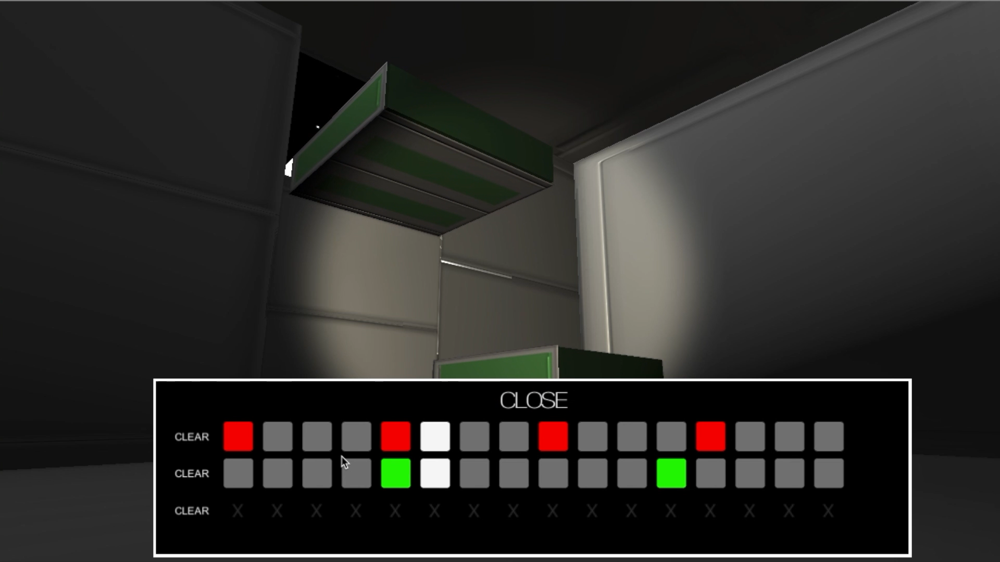

# Game Development Project

This repository contains a game development project I completed as part of my BSc in Applied Computing at the University of Dundee. 

Part of my undergraduate program involved designing and implementing a video game. For this I used the Unity Game Engine and Max/MSP (https://cycling74.com/products/max). The game presents the user with an interface similar to that of a drum machine. The buttons on the interface correspond to different instruments and rhythms. A loop iterates across the buttons and plays a sound for each one that has been selected by the user. When a sound is made, a part of the environment is changed from its default state of being invisible, to being visible. In this way, the user can navigate the environment through the creation of music. To do this, the Unity code receives Open Sound Control (OSC) information from the Max application, which is used to create the sounds. 

Various game design techniques were involved including a 3D environment, first-person camera and movement, moving platforms, scene transitions, and the sound invisible/visible state management. 

